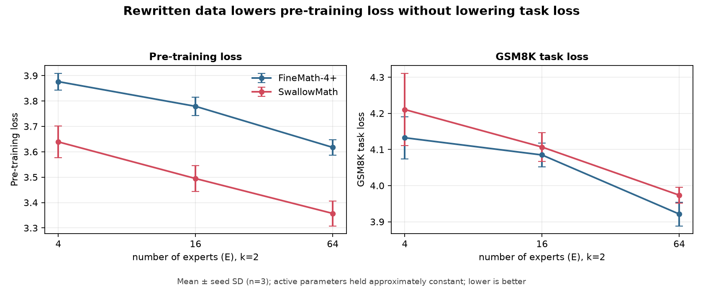

# MoE Sparsity × Data Quality Pilot

> **Scope.** This is a small-scale methodological pilot at roughly 1/1000 the compute of Nakamura et al., *Optimal Sparsity of Mixture-of-Experts Language Models for Reasoning Tasks* (ICLR 2026 Oral, [arXiv:2508.18672](https://arxiv.org/abs/2508.18672)). It cannot establish a compute-optimal sparsity law. Its purpose is to test whether an interaction between mathematical pre-training data quality and MoE sparsity is detectable in a controlled, resource-constrained setting, and to characterise what the SwallowMath rewriting pipeline changed relative to its source corpus FineMath-4+.
>
> Total budget: 18 MoE models trained from scratch, 18 billion tokens, 16.8 GPU-hours, ~$6 on a single rented RTX 4090.

---

## Question

> Under a fixed pre-training compute budget, does the quality of mathematical pre-training data change the relationship between MoE sparsity and held-out GSM8K task loss?

*Task loss is used throughout as the outcome measure. Exact-match accuracy is approximately zero at this scale, so no claim about "reasoning" is made.*

**Secondary:** are any changes accompanied by differences in expert utilization and specialization?

### The gap

Two results from the same lab sit adjacent and have never been joined.

**Paper A** ([Nakamura et al., ICLR 2026 Oral](https://arxiv.org/abs/2508.18672)) identifies an inverted-U relationship between sparsity and reasoning performance, governed jointly by **active FLOPs** and **tokens-per-parameter**; neither GRPO nor additional test-time compute eliminates the trade-off. Appendix C.8 reports that scaling 125B → 1T tokens moved TriviaQA 0.279 → 0.535 while GSM8K moved only 0.318 → 0.363, attributed to "the scarcity of high-quality mathematics and reasoning corpora available in the open source".

**Paper B** ([Fujii et al., ICLR 2026](https://arxiv.org/abs/2505.02881)) rewrites FineMath-4+ into SwallowMath, gaining +12.4 GSM8K under a fixed 50B-token continual-pre-training budget on Llama-3.1-8B.

Paper A varies architecture and holds data fixed. Paper B varies data and holds architecture fixed. This pilot varies both.

---

## Headline result



### 1. No detectable data × sparsity interaction

The question asks whether data quality changes the *sparsity relationship*. It did not, at this scale. Testing whether the paired condition difference varies with expert count:

| | F(2,6) | p |
|---|---|---|
| held-out GSM8K task loss | 0.405 | 0.684 |
| pre-training loss | 0.253 | 0.784 |

**No interaction is detectable.** The condition effect is statistically flat across E = 4, 16, 64. What follows are main effects, not interaction effects.

### 2. Rewritten data lowered pre-training loss without improving task loss

The two metrics moved in opposite directions in all nine paired comparisons.

| | pre-training loss | held-out GSM8K task loss |
|---|---|---|
| E=4 | −0.2373 | +0.0780 |
| E=16 | −0.2844 | +0.0219 |
| E=64 | −0.2601 | +0.0523 |
| **pooled (n=9)** | **−0.2606** | **+0.0507** |
| t | **−10.69** | +2.16 |
| p | **0.00001** | 0.063 |
| 95% CI | [−0.317, −0.204] | [−0.004, +0.105] |
| consistent direction | 9/9 lower | 9/9 higher |

SwallowMath is significantly *easier to model* and no better on the held-out task. Any downstream benefit at this scale is bounded below ~0.1 task loss.

This is a loss–capability divergence of the kind Paper A demonstrates by varying architecture, arrived at here by varying data. The Phase A measurements below are consistent with a mechanism — the rewriting pipeline measurably reduces surface-form diversity — though this pilot does not establish causation.

---

## 1. Data characterization

Full corpus enumeration plus distributional statistics on 200k-document samples per corpus.

### Document counts (exact, full streaming enumeration)

| | documents | tokens (published) |
|---|---|---|
| FineMath-4+ | 6,699,493 | 9.6B |
| SwallowMath | 6,497,564 | 2.3B |
| ratio | **0.9699** | |

Document counts are near parity (0.97), consistent with a roughly 1:1 rewrite rather than aggressive filtering, and with a token reduction driven by shortening (documents are 39% of original length). **This does not establish that the same documents were retained** — SwallowMath exposes no source ID, so a differently-composed 97% cannot be ruled out.

*Note:* the HuggingFace datasets-server reports 2,628,785 rows for SwallowMath. That is a partial count from a 5GB-truncated parquet conversion of a 12.8GB dataset, and it is wrong by a factor of 2.5.

### What rewriting changed

| metric | FineMath-4+ | SwallowMath | ratio |
|---|---|---|---|
| words / doc | 874.5 | 343.5 | 0.393 |
| chars / doc | 5050.7 | 1887.2 | 0.374 |
| type–token ratio | 0.0351 | 0.0311 | 0.885 |
| **distinct-4gram** | **0.7527** | **0.7069** | **0.939** |
| cosine sim. mean | 0.1199 | 0.1178 | 0.983 |
| cosine sim. p90 | 0.2627 | 0.2632 | 1.002 |

Surface-form diversity fell by 6.1% (distinct-4gram), while mean embedding similarity differed by only 1.7%. The distinct-4gram drop is conservative: SwallowMath documents are 61% shorter, so its n-gram pool is smaller and should collide *less*, biasing that statistic upward.

No formal distributional test was run on the embedding similarities, and both corpora were truncated to 2000 characters before embedding — which cuts FineMath (mean 5051 chars) far more than SwallowMath (mean 1887 chars). **The semantic-diversity comparison is therefore confounded by document length and should be treated as indicative only.** The suggestive reading is that the rewriter normalised phrasing and formatting more than topical content.

### Structural fingerprint of the rewriter

Fraction of documents containing each marker:

| marker | FineMath-4+ | SwallowMath | ×    |
|---|---|---|---|
| `## Step N` | 0.005 | 0.123 | **27×** |
| bold (`**…**`) | 0.015 | 0.239 | **16×** |
| `\boxed{}` | 0.007 | 0.083 | **12×** |
| "final answer" | 0.056 | 0.133 | 2.4× |
| numbered list | 0.281 | 0.359 | 1.3× |
| markdown header | 0.820 | 0.434 | 0.53× |
| inline LaTeX | 0.372 | 0.242 | 0.65× |
| block LaTeX | 0.174 | 0.057 | **0.33×** |

The pipeline strips markdown and LaTeX scaffolding and substitutes step-numbered prose with explicit answer markers.

### Topic retention

The SwallowMath dataset card lists possible over-representation of certain problem types as a suspected bias. Measured, relative to FineMath-4+:

| topic | retention |
|---|---|
| algebra | 0.90 |
| arithmetic | 0.89 |
| probability | 0.75 |
| geometry | 0.70 |
| calculus | 0.66 |
| linear algebra | 0.64 |

Algebraic and arithmetic content survives ~1.4× better than geometric and analytic content.

### Decontamination

The SwallowMath card documents no decontamination procedure. 13-gram overlap against the GSM8K test set, 50k documents sampled per corpus:

| | contaminated | rate |
|---|---|---|
| FineMath-4+ | 1 | 2 × 10⁻⁵ |
| SwallowMath | 2 | 4 × 10⁻⁵ |

**No contamination signal was detected in a 50k-document sample per corpus.** This is a spot-check, not a corpus-wide guarantee. The scan also strided by 3 tokens, so it catches roughly 1 match in 3 — true rates are likely ~3× these figures and still negligible.

---

## 2. Released checkpoint analysis

Six released `llm-jp/optimal-sparsity-math-d512-*-k2` checkpoints. Total parameters span 320M → 6.6B at constant 170M active — a pure sparsity gradient. (Nakamura et al. define sparsity as 1 − top-k/E; with k fixed at 2, E = 8 → 256 corresponds to sparsity 0.75 → 0.992.)

| E | total | GSM8K task loss | load CV | normalized MI |
|---|---|---|---|---|
| 8 | 320M | 1.1254 | 0.242 | 0.066 |
| 16 | 520M | 1.0541 | 0.303 | 0.087 |
| 32 | 920M | 1.0327 | 0.376 | 0.114 |
| 64 | 1.7B | 0.9736 | 0.442 | 0.137 |
| 128 | 3.3B | 0.9123 | 0.584 | 0.171 |
| 256 | 6.6B | 0.8825 | 0.707 | 0.203 |

**Task loss falls monotonically; specialization triples in lockstep** (Spearman ρ = −1.0). Load imbalance rises sharply (0.24 → 0.71) without accompanying degradation in task loss across this particular family, suggesting load balance alone is not a sufficient diagnostic here.

Specialization is measured as mutual information between domain label (math / web / code, 300 documents each) and expert assignment, per layer. Load balance alone does not imply domain preference.

**Caveat:** total parameters rise 20× across this range, so specialization and capacity are confounded. These six points cannot separate them.

**Not previously reported:** E=256 has 9 dead experts across 6 of 16 layers. All five smaller configurations are clean.

**TPP context.** At their 125B-token budget this family spans TPP ≈ 390 → 19 (total parameters), approaching their reported reasoning optimum of ~20 from above without crossing it. Active parameters are held at 170M throughout, so this family varies only the TPP axis. Monotonic improvement is what their framework predicts under these conditions.

---

## 3. Pilot sweep

Architecture-faithful miniature of Paper A. **Not a replication.**

| | this pilot | Nakamura et al. |
|---|---|---|
| d_model | 256 | 512 / 1024 / 2048 |
| layers | 8 | 16 |
| aspect ratio | 32 | 32 |
| FFN width | 2d | 2d |
| top-k | 2 | 2–16 |
| experts | 4, 16, 64 | 8–256 |
| tokens | 1B | 125B |
| **active non-embed** | **8.4M** | **170M – 7.1B** |

The active-parameter gap is the important one: this pilot is ~20× below their *smallest* configuration, placing it firmly in the low-compute regime of their analysis.

Preserved from their configuration: AdamW (β = 0.9/0.95), peak LR 4e-4, cosine decay, weight decay 0.1, aux load-balancing coefficient 1e-2, router z-loss 1e-3, sequence length 2048.
Scaled: warmup is 2% of total steps (76 of 3814), not their literal 2000 — at this schedule a verbatim 2000-step warmup would consume half of training.

**Design:** 3 expert counts × 2 data conditions × 3 seeds = 18 runs. Conditions are token-matched exactly (999,999,488 tokens, math fraction 0.2499995 in both) and share a byte-identical non-math half. Both use the same 16k BPE tokenizer trained on raw FineMath-4+. Runs are seed-paired: identical initialization across conditions.

### Results

| E | TPP | condition | GSM8K task loss | sd | pre-train loss | sd |
|---|---|---|---|---|---|---|
| 4 | 68 | FineMath-4+ | 4.1325 | 0.0582 | 3.8763 | 0.0328 |
| 4 | 68 | SwallowMath | 4.2106 | 0.1003 | 3.6390 | 0.0624 |
| 16 | 19 | FineMath-4+ | 4.0848 | 0.0333 | 3.7790 | 0.0366 |
| 16 | 19 | SwallowMath | 4.1067 | 0.0399 | 3.4945 | 0.0516 |
| 64 | 4.9 | FineMath-4+ | **3.9213** | 0.0330 | 3.6172 | 0.0303 |
| 64 | 4.9 | SwallowMath | 3.9736 | 0.0216 | 3.3571 | 0.0493 |

### Pre-registered prediction: FAILED — and the failure is explained by the source paper

Recorded in `notes/GATES.md` before the sweep ran:

> TPP at 1B tokens: E=4 → 68, E=16 → 19, E=64 → 4.9. Nakamura et al. report reasoning peaks near TPP ≈ 20. **PREDICTION: E=16 beats both, task loss < 3.92.**

E=16 did not win. Task loss decreased monotonically with total parameters — 4.133 → 4.085 → 3.921 — with E=64 best despite sitting at TPP 4.9, far below the reported optimum.

**The prediction was built on one of their two axes and ignored the other.** Nakamura et al. identify *Active FLOPs* and *TPP* as jointly determining optimal sparsity. The prediction used TPP alone. Their §3.3 is explicit about what happens on the other axis:

> "At lower FLOPs, increasing sparsity still reduces loss and improves accuracy; however, once the FLOPs budget grows, denser models begin to perform better."

This pilot runs at **8.4M active non-embedding parameters — roughly 20× below the smallest configuration in their sweep** (170M active). It therefore sits deep in the low-compute regime where their framework predicts monotonic improvement with sparsity, and where the inverted U has not yet emerged.

**The observed monotonicity is consistent with their framework, not a contradiction of it.** The prediction failed because it was incomplete, and the outcome locates this pilot on their map rather than off it.

### Noise floor

Seed variance was measured *before* the sweep (6 runs, 2 configs × 3 seeds). Seed standard deviation on task loss: 0.018–0.100. Architecture effect E=4 vs E=64: 0.211, t = 6.7, p < 0.005. Minimum detectable effect with 3 seeds: **~0.12 task loss**.

---

## 4. Failures and negative results

**Transient router collapse at E=64.** 13 warning events across 24 runs, all at E=64, all during LR warmup (steps 40–60). Up to 4 of 64 experts received near-zero tokens, load CV spiked above 1.0, and the aux loss recovered balance by step 70. No run was permanently damaged; final `min_expert_frac` at E=64 was 0.012 against a uniform 0.0156. Not tuned away — logged and reported.

**Zero collapse at E=4 and E=16.**

**A pre-registered prediction that failed.** See above.

**The primary hypothesis was not supported.** Reported as a bounded null, not concealed.

---

## 5. Compute cost

| item | value |
|---|---|
| Models trained from scratch | 18 |
| Total tokens trained | 18B (1B per run) |
| Seed-variance calibration | 6 of the 18 (E=4 and E=64 FineMath, reused, not retrained) |
| Training wall clock | 16.83 GPU-hours |
| Hardware | 1 × RTX 4090 (Vast.ai) |
| Throughput | 270k–345k tokens/sec |
| **MFU (active non-embedding FLOPs)** | **10.5% (E=4), 10.1% (E=16), 8.4% (E=64)** |
| Peak VRAM | 11.9 / 12.2 / 13.5 GB |
| Estimated cost | ~$6 training, ~$15 including all phases |

MFU is computed on **active non-embedding** parameters (`6 · N_active · tok/s / peak_FLOPS`). Using total parameters would count dormant experts and inflate the figure. The decline from 10.5% to 8.4% across E=4 → E=64 is routing overhead.

MFU is low in absolute terms: d=256 matmuls are far too small to saturate a 4090, and HuggingFace's Mixtral implementation loops over experts rather than batching them.

---

## 6. Limitations

1. **Scale.** 8.4M active parameters; GSM8K exact-match accuracy is ~0. Task loss here measures surface-form modelling of mathematical text, not reasoning. The mechanism SwallowMath improves — clearer step-by-step derivations — plausibly requires a model large enough to follow steps. Fujii et al. measured on Llama-3.1-8B, roughly 1000× the active parameters.
2. **Corpus exhaustion.** 250M math tokens were drawn from SwallowMath's 2.3B (11%) versus FineMath-4+'s 9.6B (2.6%). The rewritten condition therefore saw less unique text, confounding rewriting quality with corpus diversity at a fixed budget.
3. **Mixture composition.** 25% math, against 4.79% in Fujii et al. and 4.1% in Nakamura et al. (FineMath-4+ contributes 5.1B of their 125B-token corpus, Table 1). This pilot therefore runs FineMath-4+ at roughly 6× its proportion in either source study — a deliberate amplification of the experimental variable, and a departure from both distributions.
4. **No document-level provenance.** SwallowMath exposes only a `text` field, so conditions are token- and distribution-matched, not source-matched.
5. **Absolute task-loss values were not cross-checked** against the published numbers for the released checkpoints. Trends agree with their framework; absolute agreement is unverified.
6. **Specialization and capacity are confounded** in the Phase B analysis.
7. **The stated question is an interaction question, and no interaction was detected** (F(2,6) = 0.405, p = 0.684). With 3 seeds and 3 expert counts this design has low power to detect one; absence of evidence here is weak evidence of absence.
8. **Published token counts use different tokenizers and must not be compared directly.** The SwallowMath card reports FineMath-4+ at 9.6B tokens; Nakamura et al. Table 1 reports the same corpus at 10.3B "as counted by the llm-jp tokenizer v3". Naively combining the published 9.6B and 2.3B figures with measured document counts implies ~1.03 tokens/word for SwallowMath, which is not achievable for English with any BPE tokenizer. All token counts in this pilot were measured with a single tokenizer applied to both conditions.

---

## 7. Reproduce

```bash
bash init_project.sh          # repository root
pip install -r requirements.txt
cd code

python step01_characterize.py --n-docs 200000 --out ../out/phaseA --embeddings --decontam
python step02_checkpoint_analysis.py --all --out ../out/phaseB
python step03_train_tokenizer.py --vocab-size 16000 --n-docs 500000
python step04_pack.py --condition finemath    --total-tokens 1000000000
python step04_pack.py --condition swallowmath --total-tokens 1000000000
python step06_benchmark.py --experts 4,16,64 --steps 30
bash run_seeds.sh
bash run_sweep.sh
python step08_summarize.py --pattern 'E*_*_s*' --taskloss --report-spread --plot
```

Gate answers and open items in `notes/GATES.md`. Failure log in `notes/FAILURES.md`. Training logs on Weights & Biases.

## References

- Nakamura, Ishikawa, Kawamura, Okamoto, Nohara, Suzuki, Yokota. *Optimal Sparsity of Mixture-of-Experts Language Models for Reasoning Tasks.* ICLR 2026 Oral. [arXiv:2508.18672](https://arxiv.org/abs/2508.18672)
- Fujii et al. *Rewriting Pre-Training Data Boosts LLM Performance in Math and Code.* ICLR 2026. [arXiv:2505.02881](https://arxiv.org/abs/2505.02881)
- Datasets: [`HuggingFaceTB/finemath`](https://huggingface.co/datasets/HuggingFaceTB/finemath) (finemath-4plus), [`tokyotech-llm/swallow-math`](https://huggingface.co/datasets/tokyotech-llm/swallow-math), [`HuggingFaceFW/fineweb-edu`](https://huggingface.co/datasets/HuggingFaceFW/fineweb-edu) (sample-10BT)